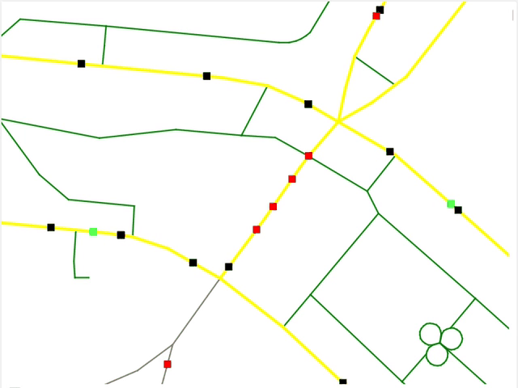

# Installation
1. Install Visual Studio 2022 or 2026 with C++ for Desktop Development.
2. Install Qt with MSVC compiler (if it doesn't show up under your Qt version, set "show archive" in the filter above).
3. Define QT6_ROOT environment variable as a path to your \Qt\6.?.?\msvc2022_64 (usually C:\Qt\...)
4. Open the Visual Studio, click "Open folder" and open your repo folder.
5. Copy the `MapsQt.ini-example` file and rename it to "`MapsQt.ini`". You can change its settings how you like.
6. Be sure to have some OSM data preprocessed with [maps](https://github.com/zlobinkd/maps) - you can set the path to it in `MapsQt.ini`
7. Select the target configuration and run the program.

## Prerequisites
- Qt 6.10 or newer
- C++17 compatible MSVC compiler
- Qt modules: Core, Quick, Widgets
- Visual Studio 2022 / 2026 with C++ for Desktop Development

# Description
**MapsQt** is an interactive data visualization tool for exploring data generated by [maps](https://github.com/zlobinkd/maps).
The program simulates road map traffic using the single-lane intelligent driver model. https://en.wikipedia.org/wiki/Intelligent_driver_model

# Qt Framework (LGPL v3)
This project uses the Qt framework under the GNU Lesser General Public License v3.
Qt is a cross-platform application framework developed by The Qt Company.

The application:
- Links dynamically to Qt libraries
- Allows users to replace Qt libraries with their own versions
- Qt's complete corresponding source code can be found at: https://code.qt.io/
